# **Modellering av funksjonalitet i appen.**

Dette dokumentet presenterer ulike UML-diagrammer som er utarbeidet med utgangspunkt i de mest sentrale funksjonelle kravene i appen:

*Krav 1: Slå opp adresser og finne koordinater

*Krav 2: Finne forventet produksjon av solcellepanel

*Krav 3: Lagre og hente lagra tak

*Krav 4: Se informasjon om penger/strøm spart


For å gjøre dokumentasjonen mer oversiktlig og redusere kompleksiteten, har vi valgt å dele opp diagrammene etter hvert funksjonelt krav. Vi benytter en kombinasjon av sekvensdiagrammer, klassediagrammer, og ved enkelte behov også use case-diagrammer for å vise ulike deler av appen. 


Ved å isolere og fokusere på utvalgte komponenter, får vi bedre innsikt i hvordan ulike funksjoner og komponenter samhandler i praksis. For hvert krav presenteres både sekvens og klassediagram. Dette gir en god balanse mellom overordnet forståelse og detaljnivå.


**Bruk av diagramtyper** <br>
**OBS: Hvis du ikke ser diagrammene, se under mappen "docs" i innelveringsmappen.**

Sekvensdiagram:
* Viser hvordan objektene i systemet kommuniserer trinn for trinn, typisk for et brukstilfelle.
*  Visualiserer rekkefølgen på metodekall, og hvordan dataen flyter.

Klassediagram: 
* Viser hvordan systemet er strukturert, gjennom data- og UI-lag.
* Hvilke data og funksjoner ulike filer har, og sammenhengen.
* Gir rask oversikt over arkitekturen.
  
I tillegg har vi utarbeidet et aktivitetsdiagram for å illustrere den overordnende kontrollflyten i appen, fra brukerens perspektiv.

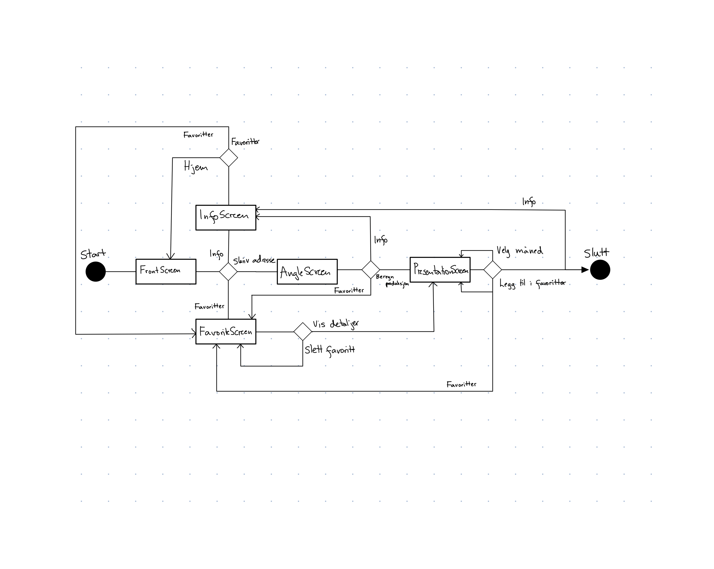

Et fullstendig klassediagram eller sekvensdiagram som dekker hele applikasjonen er svært omfattende og vanskelig å lese. Vi har derfor valgt å legge dette til som vedlegg i rapporten, for de som ønsker en mer helhetlig teknisk oversikt. 

**Krav 1: Slå opp adresser og finne koordinater**
```

Hovedflyt: Brukeren skriver inn adressen sin i et søkefelt, hvor forslag automatisk vises basert på inndata.
Etter å ha valgt riktig adresse fra listen, kan brukeren gå videre i appen for å se adressen visualisert på et kart.

Aktører:
Primær aktør: Bruker.
Sekundær aktør: Appen, GeoNorge. 

Prebetingelse:Brukeren har åpnet appen. 
Postbetingelse: Riktig adresse ble valgt og vises på et kart med tilhørende koordinater. 

Hoved flyt:
1. Brukeren åpner appen og begynner å skrive opp adressen sin i søkefeltet.
2. Forslag til adresse popper opp, og de velger den rette.
3. Appen henter data fra GeoNorge og sender med koordinater. 
4.Brukeren får opp et kart som viser adressen sin.

Alternativ flyt 1:
2.1. Brukeren skriver inn en adresse, men ingen forslag kommer opp.
2.2. Appen viser en feilmelding, og brukeren kan forsøke å skrive inn adressen på nytt.

Alternativ flyt 2:
3.1. Appen klarer ikke hente koordinater fra GeoNorge.
3.2. Feilmelding vises og brukeren kan prøve på nytt.

Under har vi valgt å ha med et use case diagram for å vise funksjonaliteten sett fra brukerens synspunkt. Det viser aktører som er involvert,
og er hjelpsomt for å vise brukerflyt.

```
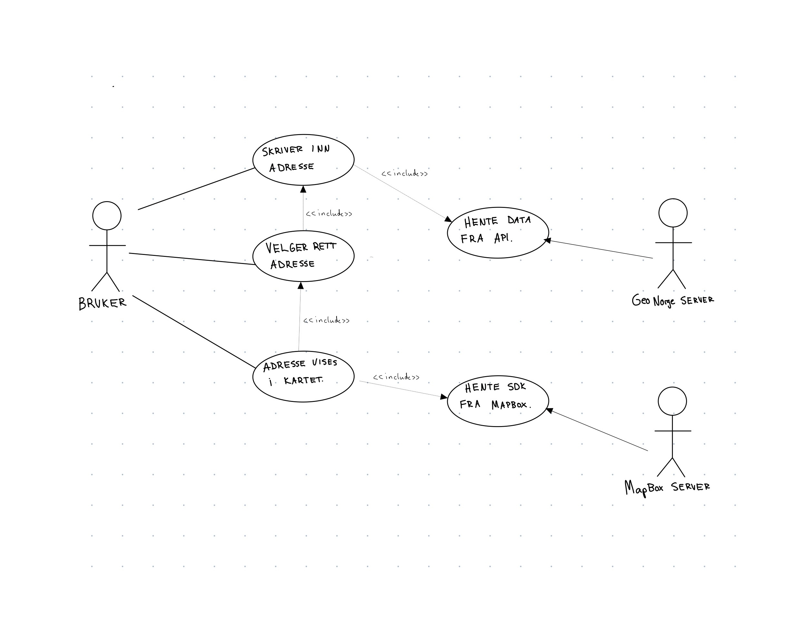

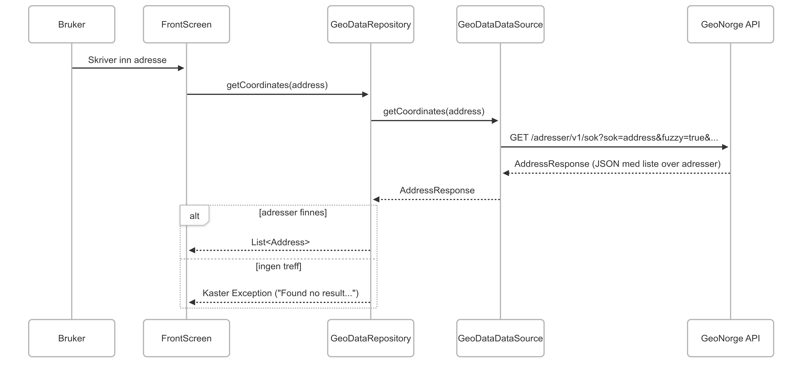
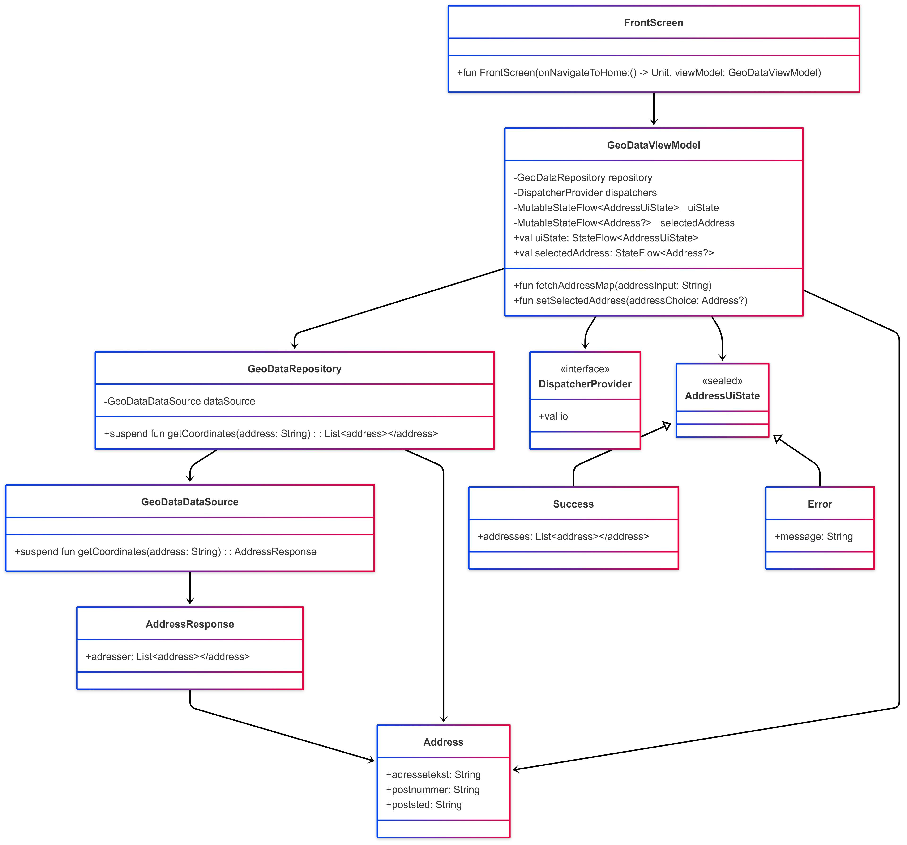

**Krav 2: Finne forventet produksjon av solcellepanel**
```


Hoved flyt: Brukeren skal kunen få et estimat på månedlig strømproduksjon basert på informasjon knyttet til deres adresse.
 
Aktører:
Primær aktør: Bruker.
Sekundær aktør: Appen, Frost, PVGIS, HvaKostersStrømmen.

Prebetingelse: Brukeren har skrevet inn adresse i appen, og navigert til AngleInputScreen.
Postbetingelse: Side med informasjon om strømbesvarelse vises.

Hoved flyt:
1. Bruker fyller inn data om taket sitt.
2. Appen henter strømpriser og solforhold basert på den valgte adressen og solinformasjon, ved å hente data fra APIene PVGIS, Frost og HvaKosterStrømmen.
3. Bruker navigeres til PresentationScreen, der strømbesparelse vises basert på hvilken måned brukeren velger å se data for.

Alternativ flyt 1:
1.1. Brukeren legger ikke inn nødvendig informasjon om taket.
1.2. Appen gir en feilmelding og ber brukeren fylle inn manglende data før de kan gå videre.

Alternativ flyt 2:
2.1. Ett eller flere API-kall feiler, f.eks. ugyldige data.
2.2. Appen viser feilmelding, og gir mulighet for å prøve igjen.

Alternativ flyt 3:
3.1. Det er ikke tilgjengelig sol- eller strømdata for den angitte adressen, og appen foreslår å prøve en annen adresse. 


Her bruker vi PVGIS, Frost og HvaKosterStrømmen API. Sekvensdiagram for HvaKosterStrømmen ligger under krav 4.


```
Sekvens diagram for Frost
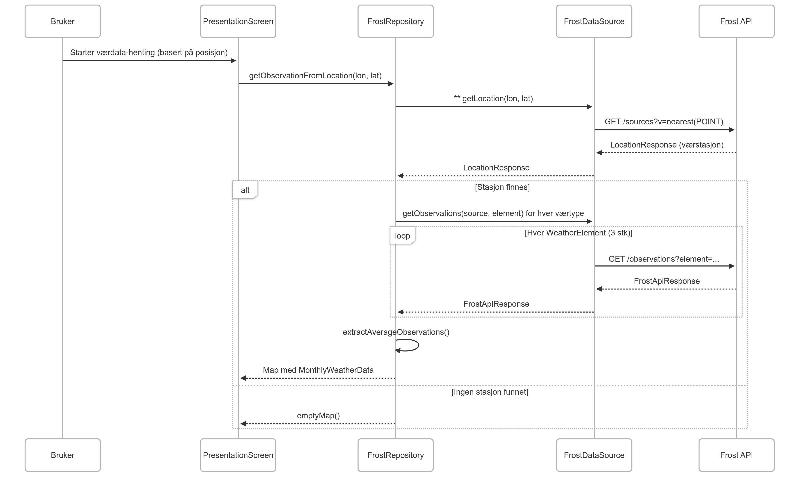

Sekvens diagram for PVGIS
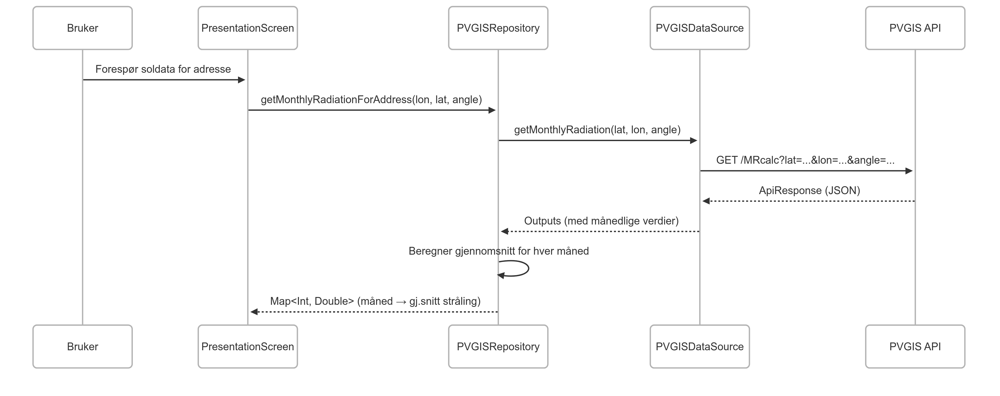


```
Klassediagram for samhandling mellom APIer. 
For å få en oversikt over hvordan applikasjonen henter og organiserer data fra tre ulike APIer-FROST, PVGIS og HvaKosterStrømmen,
har vi valgt å visualisere strukturen ved hjelp av et klassediagram.
Dette gir et tydelig bilde av hvordan PresentationScreen henter data fra de ulike APIene og
hvordan det fordeles mellom ulike komponenter i arkitekturen.

```

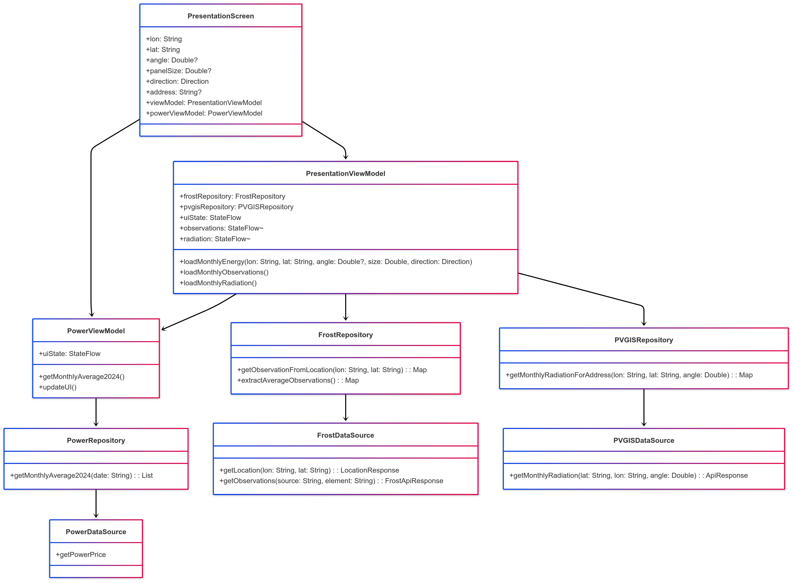


**Krav 3: Lagre og hente tak**
````
Tekstlig beskrivelse av Use Case: 
Hovedflyt: Brukeren skal kunne lagre en adresse (med tilhørende solcelleparametere) som favoritt for enkel gjenbruk senere.

Aktører: 
*Primær aktør: Bruker.
*Sekundær aktør: Appen, FavoritDatabase


Prebetingelser: Brukeren har åpnet appen og er på PresentationScreen. Det er allerede hentet inn gyldig data basert på adresse.
Postbetingelse: Brukeren kan gå til favoritt siden og se adressen sin lagret der. Videre kan de klikke på adressen sin og bli tatt rett til presentationScreen hvor de får info basert på dataen de tidligere la inn. 


Hoved flyt: 
1. Brukeren trykker på "Legg til i favoritter".
2. UI-et sender en forespørsel til PresentationViewModel om å legge til en ny favoritt.
3. ViewModel oppretter et Favorite-objekt med gjeldende data (adresse, koordinater, vinkel, areal og retning).
4. ViewModel sender objektet til favoritt-siden.
5. Systemet lagrer objektet lokalt.
6. UI-et viser at lagringen var vellykket, ved at knappen deaktiveres og ikke lengre kan trykkes på.

Alternativ flyt 1:
2.1. Feil under lagring.
Hvis noe går galt under lagring, eks en databasefeil, vises en feilmelding til brukeren.
````

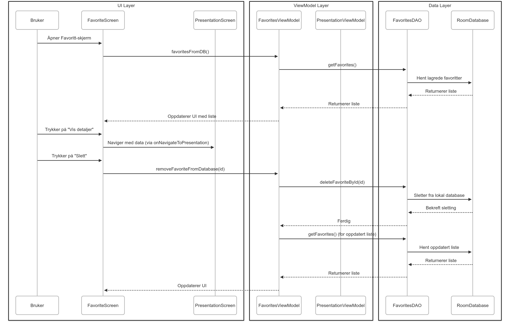
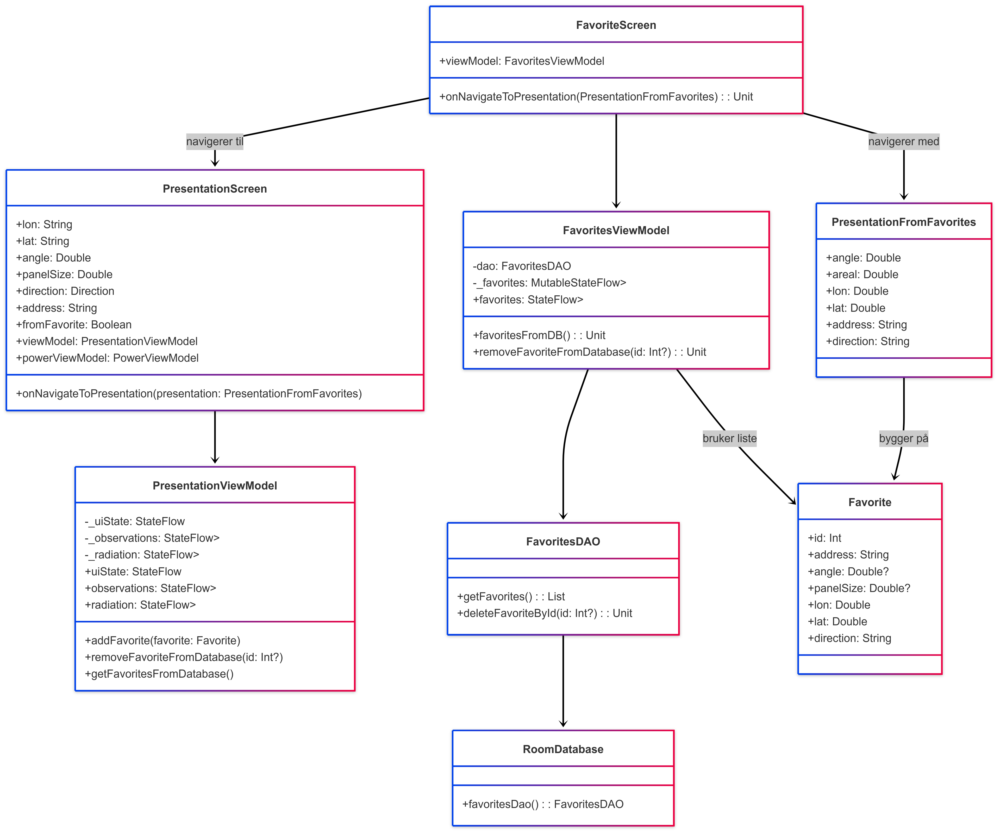

**Krav 4: Se informasjon om penger/strøm spart**
````
Hovedflyt: Brukeren ønsker å estimere hvor mye de kan spare på strøm med solcellepaneler, basert på egen bolig og forbruk. 
Aktører:
* Primær aktør: Bruker.
*Sekundær aktør: Appen, HvaKosterStrømmen

Prebetingelse: Brukeren har åpnet appen og lagt inn informasjon om boligen.
Postbetingelse: Brukeren får se estimert besparelse i kroner og kilowattimer (per måned/år).
Det blir presentert i et diagram.

Hovedflyt:
1. Bruker åpner appen og legger inn adresse, får opp adressen i kart og klikker videre.
2. Brukeren legger så inn data om boligen, og går videre til skjerm som viser utregning.
3. Appen henter strømpriser og mulig besparelse.
4. Resultatene vises i en graf og enkelt tallformat.

Alternativ flyt 1:
1.1. Brukeren skriver inn en adresse som ikke finnes innenfor GeoNorge sitt register.
1.2. Appen viser en feilmelding, og brukeren kan prøve å skrive adressen inn på nytt.


Alternativ flyt 2:
2.1. Brukeren fyller ikke ut alle nødvendige felter om boligen.
2.2. Appen gir tilbakemelding om hva som mangler og tillater ikke å gå videre før alt er fylt ut.

Alternativ flyt 3:
3.1. Appen klarer ikke hente strømpriser fra HvaKosterStrømmen.
3.2. Appen viser en feilmelding, og brukeren får mulighet til å forsøke på nytt. 
````
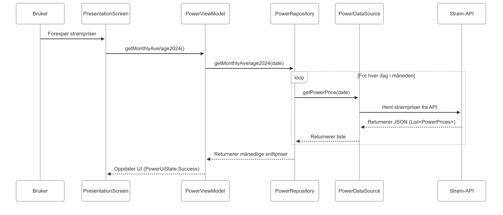
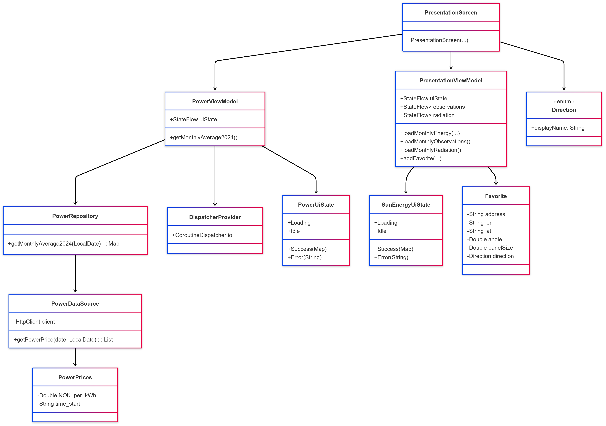
    
